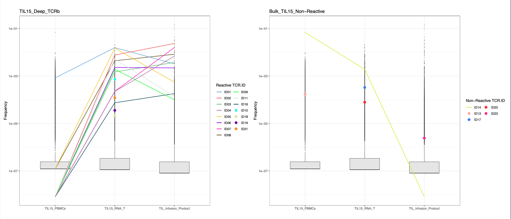

# Cross-Sample Clonotype Frequency Analysis

## Overview

This module compares TCRβ clonotype frequencies across bulk repertoire samples from tumor biopsy, peripheral blood, and TIL infusion product samples.

## Workflow

### Script: `ITAG_TIL15_S03_m1.Rmd`

- Imports bulk TCRβ repertoire tables from multiple patient-derived samples.
- Retains productive in-frame clonotypes only.
- Defines clonotypes using CDR3β amino-acid sequence together with TRBV and TRBJ genes.
- Calculates within-sample clonotype frequencies.
- Annotates validated clonotypes using `reactive-clono.txt`.
- Compares reactive and non-reactive clonotype frequencies across samples.

## Output

   
  <em>Frequency of TCRs-of-interest in the indicated samples.</em>

